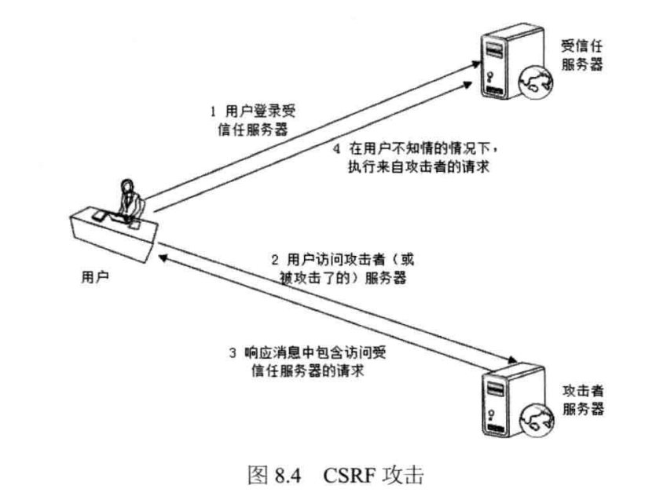

# 《大型网站核心架构》笔记

大网站除了业务上的复杂度外还存在很多工程上的问题，采用分布式、缓存、分离等技术

先有的云计算平台可以实现技术的复用，每个公司不需要再重复研发相似的技术，而是使用云计算提供的计算、存储、网络服务。

技术是为了业务服务，不要脱离实际创造不存在的技术需求。发展遵循循序渐进，采用适合自己的技术，而不是一味地追求最好的技术（*XXX产品就是这样干的*）。解决问题的思路不仅仅要局限于技术上，对业务进行重构可能是更好的选择。

伸缩性：通过不断地向集群中增添服务器的手段，缓解不断上升的用户并发压力和不断增长的数据存储需求。

网站可伸缩架构的主要手段是事件驱动架构和分布式服务。

NoSQL 数据结构和存储方式与关系型数据库有差异，NoSQL 的伸缩性一般会更强。

扩展性：网站增加新的业务时，是否实现对现有产品透明无影响，不需要任何改动或者只需要很少改动就能让新产品上线。

计算机的任何一个问题都可以通过增加一个虚拟层实现来解决。

NoSQL 在分布式上个会支持更好。关系型数据库系统比分布式关系型数据库系统功能强大很多，因为在分布式环境下，很多容易在单机上进行的操作很难进行，需要在多台服务器上传输数据和协同同步，如 JOIN、事务等等。

## 常见的攻击手段

