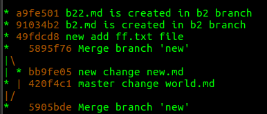
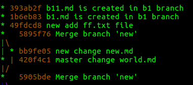
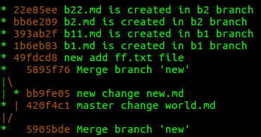
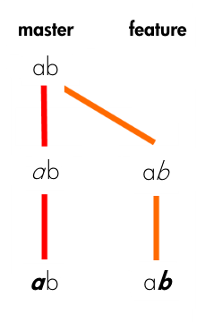

# Git in short


## 基本概念


- 工作目录（working directory）：文件系统能够直接看到的文件，以及文件中的内容；所有分支共享的
- 暂存区（stage）：`git add` 命令就是将修改放入暂存区；暂存区是所有分支共享的
- 版本库（repository）：`git commit` 提交暂存区中的修改，对于当前分支

## 初始化仓库

```
git init
```

## 查看文件修改内容

与工作目录中的文件内容与最新的 commit 对应的文件做对比

```
git diff README.md
```

JetBrains 等 IDE 可视化在这方面做得更好

## 查看仓库修改状态

```
git status
```
## 添加修改

指定文件

```
git add filename
```

添加文件夹下的所有修改

```
git add dir
```

正则表达式

```
git add *
```

## 提交更改

提交所有修改过，而且经过 `git add` 的文件

```
git commit -m "description"
```

git add 与 git commit 合并为一条命令。添加当前仓库的所有修改，然后 commit

```
git commit -a -m "description"
```

## 查看 commit 日志

```
git log
```

```
git reflog
```

`git log` 只能看当前分支的 commit 记录。

`git reflog` 查看所有的 commit 记录（包括其他分支）。能看到 reset 等命令的记录，`git reset --hard HEAD` 命令执行后 `git log` 无法查看之前的版本信息，而 `git reflog` 可以。

查看

```
git log --graph
```

## 回滚

- HEAD：代表当前版本，也就是最新的提交
- HEAD^：代表上一个版本
- HEAD^^：上上个版本
- 以此类推

### 硬回滚

```
git reset --hard HEAD
```

```
git reset --hard commit_id
```

```
git reset --hard HEAD@{2}
```

`git reset --hard` 同时放弃了工作区和暂存区的修改，对当前分支直接进行了回滚。

### 放弃工作区的修改

```
git checkout -- filename
```

- 如果 `git add filename` 还没执行，回滚某个文件到当前分支最新的 commit 中
- 如果 filename 没有被 git commit，也没有被 git add，执行失败
- 否则，将工作区的文件的放弃，文件内容同步到暂存区的一样

如果工作区删除了 filename，上命令也可以进行恢复。

### 放弃暂存区的修改

因为已经执行过：`git add filename`，已经把文件添家到暂存区了，目的是将 filename 的修改移除暂存区，commit 有用的修改。

```
git reset HEAD filename
```

注意，上命令并不会修改工作区中文件的内容，仅仅是操作了暂存区。

## 分支

### 查看分支

```
git branch
```

### 创建新的分支

创建分支 branch_name，并切换到该分支：

```
git checkout -b branch_name
```

切换到已经存在的分支：

```
git checkout branch_name
```

### 合并分支

将 branch_name 分支的内容合并到当前分支

```
git merge branch_name
```

合并有两种可能：

1. current_branch 落后于 branch_name，也就是 current_branch 在 branch_name 的某个历史状态，如下图：


这种情况的 merge 很好解决，默认情况下使用 fast-forward 直接将 current_branch 指向 branch_name，merge 不会产生一个新的 commit。

使用 fast-forward，如果这时候删除了 branch_name 分支，那么在历史信息中就找不回 branch_name 分支信息了，因为被 current_branch 分支的信息覆盖了，无法再恢复 branch_name 分支。

可以通过禁止 fast-forward，而是通过新生产一个 commit 的方法 merge，这样就可以将 branch_name 分支的信息留在历史中：

```
git merge --no-ff -m "no fast-forward merge" branch_name
```

效果如下：


2. current_branch 与 branch_name 处于不同的分支上，出现了分叉，如下图：


产生冲突有两种情况：

1. 修改了同一个文件的同一行
2. 修改了同一个文件的不同行 or 修改了不同文件

对于 1 的情况，需要手动解决冲突。在产生冲突的地方，git 会阐述当前分支和 branch_name 分支在冲突部分的差异，格式如下：

```
  3 <<<<<<< HEAD
  4 hello world master branch
  5 =======
  6 hello world new branch
  7 >>>>>>> new
```

对于 2 的情况，git 能够为我们自动解决该冲突，并且产生一个新的 commit 其 message 格式：`Merge branch 'branch_name'`。对于多人进行开发的项目，如果每一个 commit 都产生情况 2 的冲突，那么就会产生很多无谓的 merge commit，也不利于定位问题。

### 删除分支

```
git branch -d branch_name
```

如果需要强行删除分支：

```
git branch -D branch_name
```

删除远程分支：

```zsh
git push origin --delete gh-pages
```

### 本地分支与远程分支的映射

```
git branch --set-upstream-to=origin/dev dev
```

将本次的 dev 分支与远程的 origin/dev 分支进行映射后，下次可以直接执行 `git pull`、`git push` 等命令。

### 本地创建一条新分支与远程保持同步

```
git checkout -t origin/dev
```

命令在本地创建一个名为 dev 的分支，然后 upstream 与 origin/dev 进行关联。

### 查看分支 upstream

```
git branch -vv
```

结果如下：

```
(env) ➜  test git:(gh-pages) ✗ git branch -v 
* gh-pages ff99c03 Deployed dc48dce with MkDocs version: 0.17.3
  master   9744d73 master merge new branch stop ff
  new      49fdcd8 new add ff.txt file
  s        49fdcd8 new add ff.txt file
```

## 保存现场

假设有一个 bug 需要马上修复，但是我们手头的代码还没写完，commit 的话会产生很多无谓的消息，这时候就需要保存工作现场。

```
git stash
```

查看 stash 中都有什么：

```
git stash list
```

值得一提，stash 是所有分支所共享的，也就是别的分支可以引用本地的 stash。

恢复现场，但是不删除现场的历史：

```
git stash apply stash@{0}
```

删除现场：

```
git stash drop stash@{0}
```

上述两条命令可以使用一条命令代替：

```
git stash pop
```

## 拉取远程分支

```
git fetch
```

`fetch` 与 `pull` 的区别：


## rebase

re-base：
- re：重复的，比如 redo 再做
- base：基

所以 rebase 可以理解为基基，也就是 GG（哈哈），听说很容易出事情。

git rebase 是会改变 commit 记录的，如果本分支已经 push 到远程了，那么不推荐进行 rebase 操作，rebase 的作用是为了使得提交记录更加美观，利于未来查找问题或 code review。

```
git rebase branch_name
```

找到 branch_name 与 current_branch 的公共最晚提交 c，然后将 branch_name 分支 c 后的提交加在 current_branch c 后。

设 `current_branch=b2`、`branch_name=b1`

b2 分支 rebase 前的 log：



b1 分支的 log：



在 b2 分支执行 `git rebase b1` 后，b2 的 log：



在朋友博客看到两张比较好的描述 rebase 的图片：

设 `current_branch=feature`、`branch_name=master`

rebase 前：



在 feature 分支执行 `git rebase master` 后：


### rebase 遇到的问题

```zsh
➜  test git:(b1) git rebase b2

It seems that there is already a rebase-apply directory, and
I wonder if you are in the middle of another rebase.  If that is the
case, please try
	git rebase (--continue | --abort | --skip)
If that is not the case, please
	rm -fr "/home/g10guang/Public/test/.git/rebase-apply"
and run me again.  I am stopping in case you still have something
valuable there.
```

解决方法：[https://stackoverflow.com/a/8780538/7159205](https://stackoverflow.com/a/8780538/7159205)

## 标签

标签 tag 用于更好地定位某一个 commit 记录。

```zsh
git tag v0.1 [commit_id]
```

默认在当前分支最新的 commit 记录打标签。

附带 message 的 tag：

```zsh
git tag -a v0.1 -m "version 0.1 released" commit_id
```

### 查看标签

```
git tag
```

### 删除标签

删除本地标签：

```
git tag -d v0.1
```

删除远程标签：

```
git push origin :refs/tags/<tagname>
```

### 推送标签到远程

tag 存储在本地，需要显示将其推送到远程

```
git push origin [tag_name]
```

一次性推送所有还没推送到远程的标签：

```
git push origin --tags
```

## git show

查看标签：

```
git show v1.0
```

查看提交记录：

```
git show commit_id
```

## 其他

[Github .gitignore](https://github.com/github/gitignore)

[图解 Git](http://marklodato.github.io/visual-git-guide/index-zh-cn.html#rebase)

